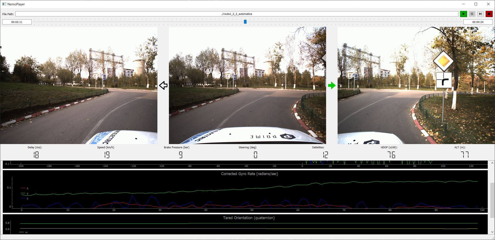

# NemoData
Tools that facilitate the manipulation of Nemodrive session recordings

## Installation

Clone locally and build using pip:

```
git clone https://github.com/nemodrive/nemodata.git
cd nemodata
pip install .
```

Make sure to use your anaconda env (if you so desire) during installation

## Examples

### Playback

To use the player in your own scripts:

```python
from nemodata import Player

with Player("/home/dataset/session_1/") as p:
    for packet in p.stream_generator(loop=False):

        print(packet) # TODO your code here

```

### Playback at lower sample rate

```python
from nemodata import VariableSampleRatePlayer

with VariableSampleRatePlayer("/home/dataset/session_1/", min_packet_delay_ms=300) as p:
    for packet in p.stream_generator(loop=False):

        print(packet) # TODO your code here

```

### Playback as decompressed

Will fill in None values (where no data was available from the sensor at the time of recording)
with data from the previous frame for that field

```python
from nemodata import Player
from nemodata.compression import Decompressor

with Player("/home/dataset/session_1/") as p:
    
    _default_generator = p.stream_generator(loop=False)
    decompressed_generator = Decompressor(_default_generator).uncompressed_generator()

    for packet in decompressed_generator:

        print(packet) # TODO your code here

```

To visualise a recording in human-readable format run the following command:
```
nemoplayer
```

Which will open the graphical user interface



#### Notice:

Due to current GUI limitations you have to pause the video to enable seek functionality.
